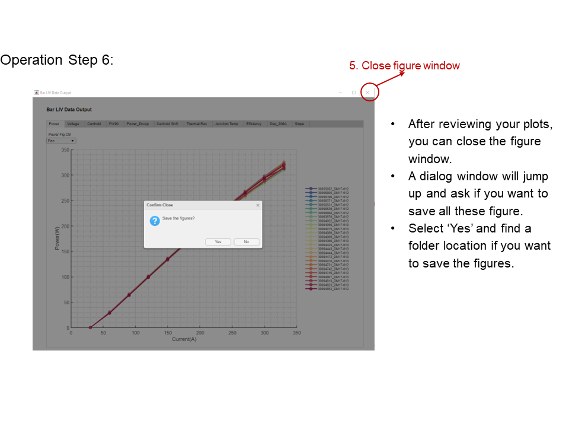

# Auto Report Generation GUI App

## Motivation:

Diode lasers with different design structures are usually assigned with different project IDs and could be built from different wafers with ID information.  These devices need to be tested in R&D and production labs for cross-comparison purpose. After testing, data will be uploaded to SQL database with test dates, locations, device serial numbers and other information. To quantify the device performance with different design structures, test data needs to be carefully analyzed to provide informative feedback. Data is reviewed on weekly basis to point to the correct direction for design change and benefit the decision-making process on managing level. However, querying, merging, and filtering data from different databases manually were time-consuming and there were no such tools which facilitated data visualization and comparison. 

## Solution:
...To help the data analysis process, I have designed and implemented the auto-report generating GUI App. It has functionalities such as querying different databases, merging datasets with filtering criteria, self-generating the analysis report with plots, etc. The filtered data can be exported to Excel for future reference and other post-processing purposes. The application has been used extensively by colleagues which has saved tremendous amount of time by replacing manual report generation process.  This application is created using MATLAB, app designer and SQL. 

## User Interface and Instructions
1. SQL database snapshots:

2. UI:

3. Operation steps: 
* Step1:

* Step2: 

* Step3:

* Step4: 

* Step5: 

* Step6: 

* Step7: 

